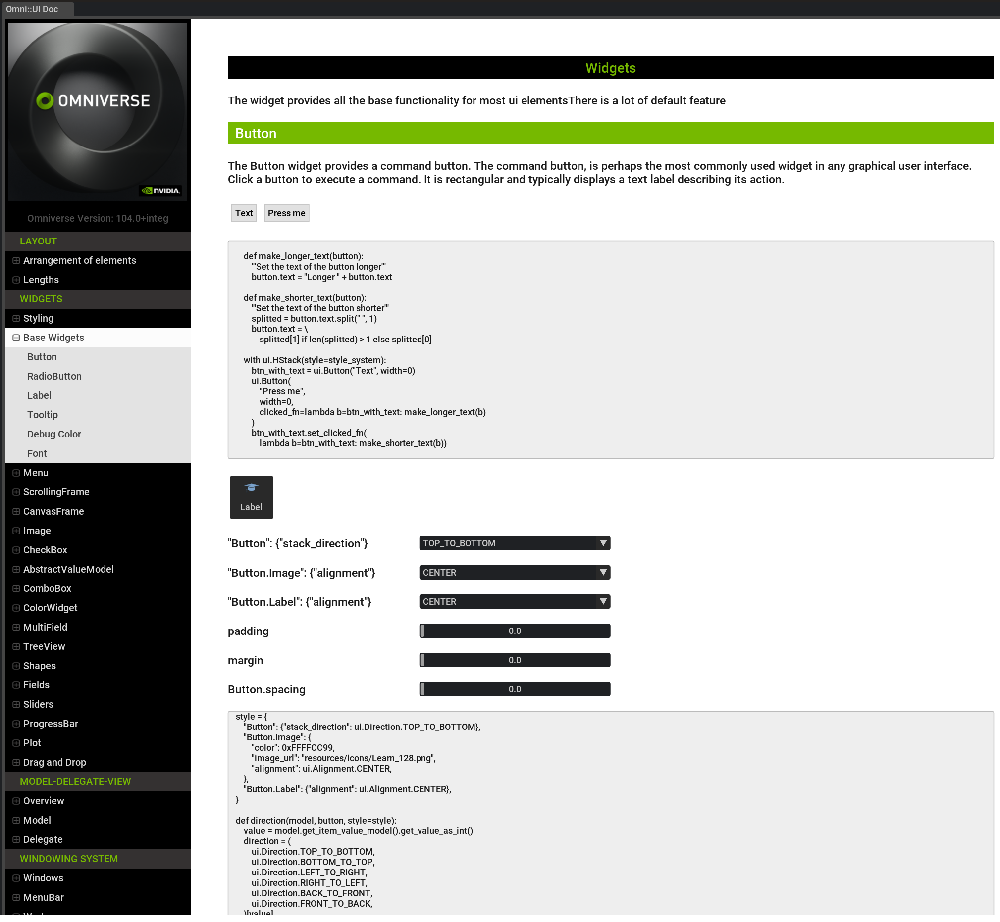
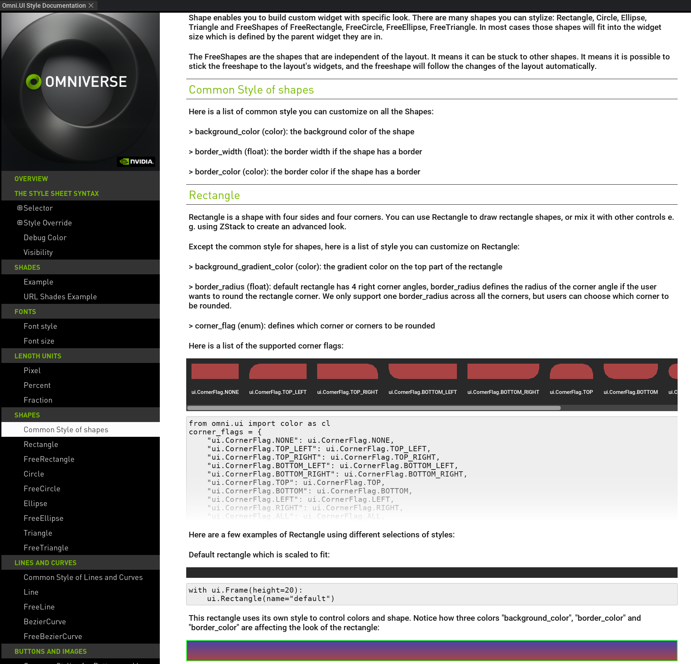

# Overview
The Omniverse UI Framework is the UI toolkit for creating beautiful and flexible graphical user interfaces in the Kit extensions. It provides a list of basic UI elements as well as a layout system which allow users to create a visually rich user interface. Widgets are mostly a combination of the basic shapes, images or texts. They are provided to be stepping stones for an interactive and dynamic user interface to receive user inputs, trigger callbacks and create data models. The widgets follow the  Model-Delegate-View (MDV) pattern which highlights a separation between the data and the display logic. Users will be able to find all the omni::ui properties and APIs for each ui element, both C++ and python, in this documentation. 

## Example
To demonstrate how each ui element is working, how to use layout to construct more complicated widgets and how MDV works in our UI system, we provide an interactive extension called `omni.example.ui`. Users can easily enable it through the kit extension registry. It provides excessively interactive and live examples where users can explore to understand how omniverse UI works.

## Style
To build customized widgets and serve different user queries, all the omniverse ui elements support style override to make these widgets visually pleasant and functionally indicative with user interactions. Each widget has its own style attributes to tweak, which they also follow the same syntax rules. We provide an interactive extension called `omni.kit.documentation.ui.style`. Just like `omni.example.ui`, users can enable it through the kit extension registry. It lists all the supported style attributes for each ui element, provides interactive examples where users can explore the very flexible styling system that allows deep customizing the final look of the application.

